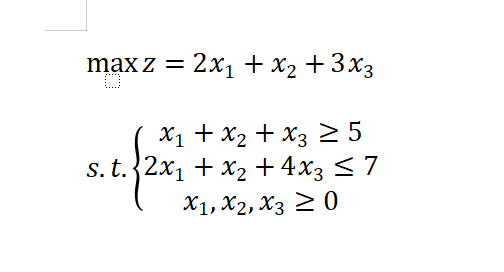
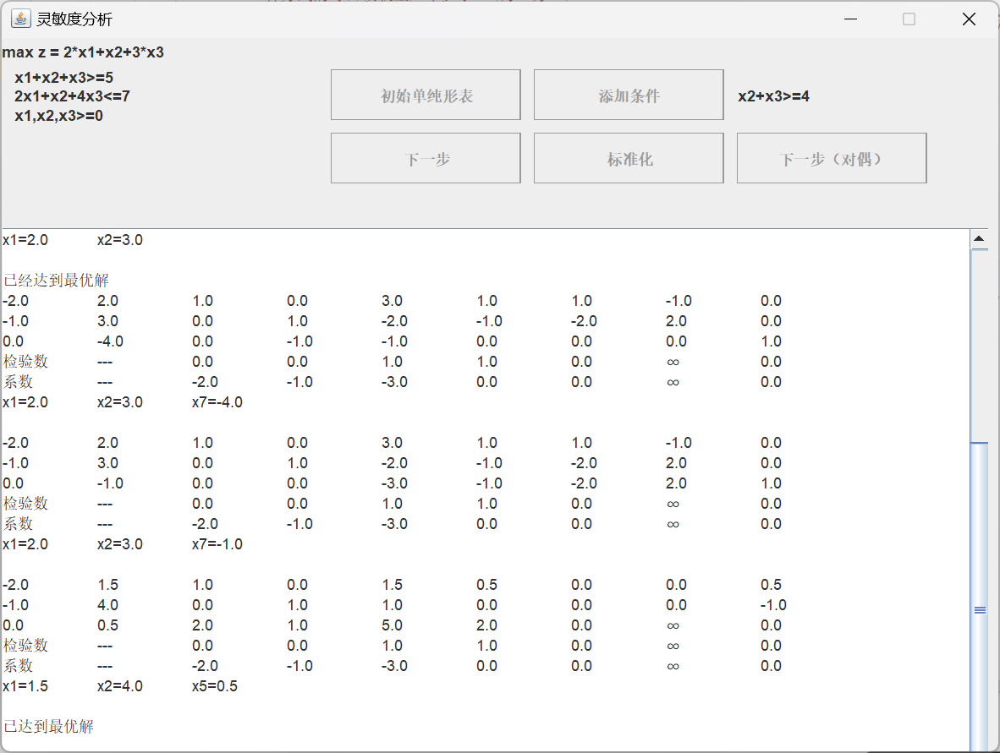

## Simplex
单纯形法+灵敏度分析
## 问题描述
碳中和一般是指国家、企业、产品、活动或个人在一定时间内直接或间接产生的二氧化碳或温室气体排放总量，通过植树造林、节能减排等形式，以抵消自身产生的二氧化碳或温室气体排放量，实现正负抵消，达到相对“零排放”。已知某M区域内有三种方式吸收二氧化碳，分别是植树造林、节能减排、碳补偿，三种方式单位面积吸收二氧化碳量为1（万立方）。考虑到M区域碳排放情况，三种方式的每日吸收量应不少于5（万立方）。植树造林的单位成本为2（元），节能减排单位成本为1（元），碳补偿单位成本为4（元）。考虑到政府经费有限，故每日用于碳排放的支出不高于7（万元）。已知通过三种方式吸收每立方二氧化碳可获得经济收益分别为2（元）、1（元）、3（元），试问该M市如何确定各种方式的吸收量？  
该市在方案实际运行时发现，节能减排的和碳补偿吸收量累积不少于4（万立方）才能满足市民的需求。为了提高市民满意度，试问该市政府如何调整各方式吸收量，才能满足市民需求的同时使经济效益最大化？  
## 建模

## 展示
